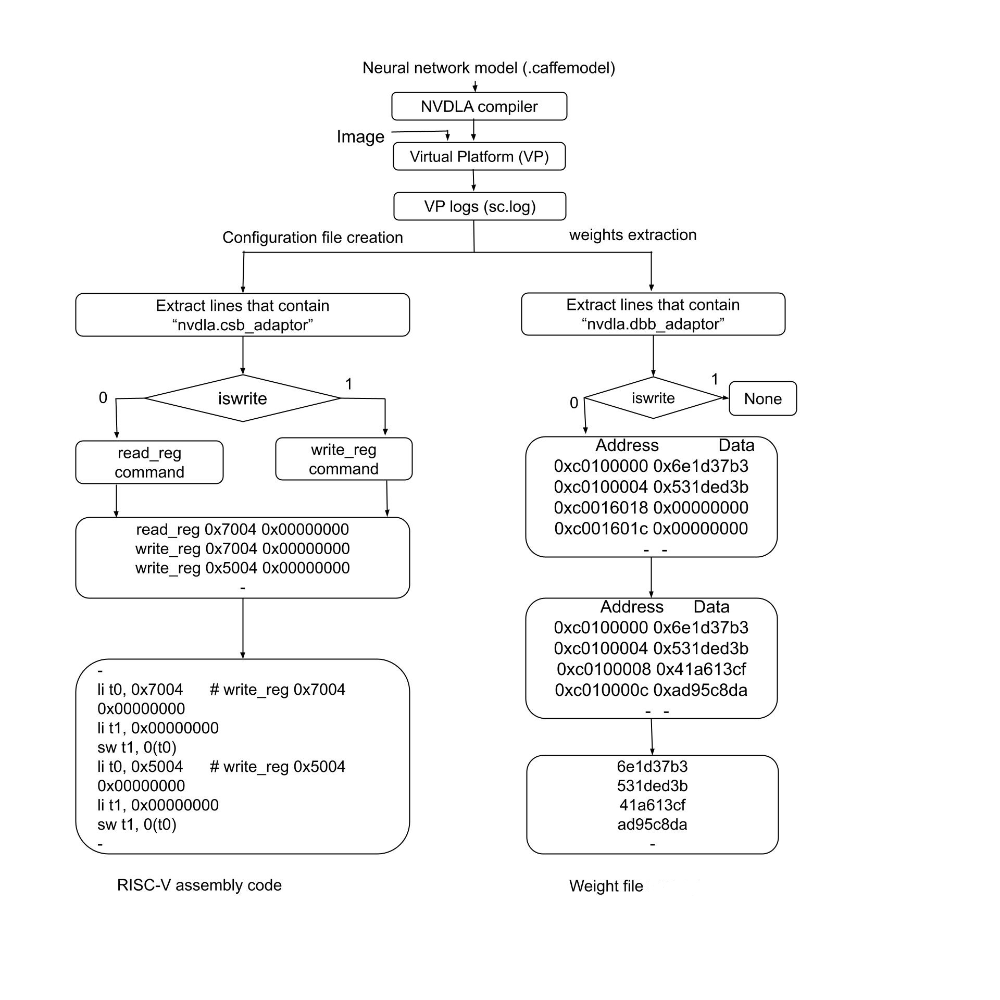

# RISC-V + [NVDLA](https://nvdla.org/) Software
<p align="justify"> 
This repository presents an open-source software generation flow that can be used to run a Caffe neural network model on any RISC-V + <a href="https://nvdla.org/">NVDLA</a> based SoC without need of a Linux kernel. The software development flow described below generates RISC‑V assembly/machine code and extracts neural network weights from a Caffe model. The Caffe model is first compiled using the NVDLA compiler and executed on NVDLA’s virtual platform (VP). During execution, interface-level transactions such as configuration bus (CSB) and system data bus (DBB) are logged for analysis. The logs tagged with nvdla.csb_adaptor are parsed to extract register accesses, which are translated into read_reg or write_reg commands based on the access type and compiled into RISC‑V assembly for loading into program memory. Similarly, logs tagged with nvdla.dbb_adaptor are examined to identify memory transactions, allowing weights to be isolated and stored into data memory. The python scripts were used to implement this flow.  
</p>

## Citation Requirement

If you use this repository, its code, or any derivative work in your research,
please **cite the following work** as a condition of use (see LICENSE):

V. Kumar, A. M. Kumar, Y. Li, S. Shanker, and D. John, “Bare-Metal RISC-V + NVDLA SoC for Efficient Deep Learning Inference,” arXiv preprint arXiv:2508.16095, 2025. [Online]. Available: https://arxiv.org/abs/2508.16095

### BibTeX
```bibtex
@inproceedings{kumar2025riscv,
  author    = {Vineet Kumar and Ajay Kumar M and Yike Li and Shreejith Shanker and Deepu John},
  title     = {Bare-Metal RISC-V + NVDLA SoC for Efficient Deep Learning Inference},
  booktitle = {Proceedings of the 38th IEEE International System-on-Chip Conference (SOCC)},
  address   = {Dubai, U.A.E.},
  year      = {2025},
  note      = {(Accepted)},
  doi       = {10.48550/arXiv.2508.16095},
  url       = {https://doi.org/10.48550/arXiv.2508.16095}
}
```
## Repository Structure
```text
riscv-nvdla-sw/
├── lenet-5/                      # LeNet-5 example pipeline
│   ├── pmem/                     # Program memory generation (RISC-V .mem)
│   │   ├── assembly.py           # Parse VP CSB/DBB logs → RISC-V assembly
│   │   ├── minus_c0.py           # Post-process assembly (remove c0, adjust)
│   │   └── machine_code2mem/     # Convert machine code → .mem
│   │       └── machine_code_clean.py
│   │
│   └── dmem/                     # DRAM weights extraction (.bin)
│       ├── dbb_lines_extract.py
│       ├── dbb_lines2_weights.py
│       ├── subtract_c0.py
│       ├── weights_sorted.py
│       ├── divideby4.py
│       ├── remove_duplicates_divideBy4.py
│       ├── fill_missing_addr.py
│       ├── clean_weights.py
│       └── weights2bin.py
│
├── resnet18/                     # ResNet-18 example (NVDLA-compiled artifacts, scripts, etc.)
├── resnet50/                     # ResNet-50 example (NVDLA-compiled artifacts, scripts, etc.)
├── models/                       # Model assets (prototxt/caffemodel/calibration files as needed)
├── docs/                         # Documentation for the SW flow
├── images/                       # Figures used in README/docs (e.g., flow diagrams)
├── paper_nv_small_files/         # Paper-related auxiliary files (nv_small config artifacts)
│
├── LICENSE                       # License (MIT + citation clause)
├── README.md                     # Project overview, usage, and workflow
└── .gitignore                    # Ignore patterns for the repo
```


### Prerequisites
- [NVDLA Compiler](https://github.com/nvdla/sw)
- RISC-V Toolchain/SDK for the core
- Python 3.x with `numpy`, `pandas` (for preprocessing scripts)


## Software Development Flow



---

## Steps to Generate Required Files for DNN Model Deployment

### **Step 1: Generating `.mem` File (for RISC‑V Program Memory)**

These steps are used to initialize program memory of RISC‑V for a DNN model:

1. **Generate `sc.log` file** by running NVDLA loadable (`.nvdla` file) of a given Caffe model.
2. Run `assembly.py` followed by `minus_c0.py` file to generate `model.s` file.
3. Use RISC‑V toolchain or SDK to generate machine code.     
4. Process `machine_code_model.txt` using `clean_machine_code.py` to generate `.mem` file and insert an offset address in the file if required.

#### **Commands to Generate `.mem` File**
```bash
$ git clone https://github.com/vineetbitsp/riscv-nvdla.git
$ cd ~/riscv-nvdla/
$ python3 lenet-5/pmem/assembly.py
$ python3 lenet-5/pmem/minus_c0.py

# Generate .mem file from machine code
$ cd lenet-5/pmem/machine_code2mem/
$ python3 machine_code_clean.py

Note: The offset address in program memory where machine code is stored must be inserted in the .mem file.
```

### **Step 2: Generating `.bin` File of Weights (for DRAM)**

These steps are used to generate a `.bin` file of weights to be loaded in DRAM:

1. Switch to the `dmem` directory inside `lenet-5`.
2. Execute the Python scripts in the following sequence:
```bash
$ python3 dbb_lines_extract.py
$ python3 dbb_lines2_weights.py 
$ python3 subtract_c0.py 
$ python3 weights_sorted.py
$ python3 divideby4.py
$ python3 remove_duplicates_divideBy4.py
$ python3 fill_missing_addr.py
$ python3 clean_weights.py 
$ python3 weights2bin.py
```
Note: The offset address at which the weight file is stored in DRAM is given by the first entry in the output file of weights_sorted.py and must be specified while storing the weight file in DRAM.

---

## Procedure to Obtain `sc.log` File using NVDLA Virtual Platform (VP)

### Model Compilation Example Commands
```bash
./nvdla_compiler --prototxt resnet18-cifar10-caffe/deploy.prototxt \
                 --caffemodel resnet18-cifar10-caffe/resnet-18.caffemodel \
                 --cprecision int8 \
                 --calibtable resnet18-cifar10-caffe/resnet18.cifar10.fixed.json \
                 --quantizationMode per-kernel

./nvdla_compiler --prototxt ResNet-50-deploy.prototxt \
                 --caffemodel ResNet-50-model.caffemodel \
                 --cprecision int8 \
                 --configtarget nv_small \
                 --calibtable resnet50.json \
                 --informat nchw 
```
### Building VP for Debug Mode Usage
Example: Running Lenet-5 on nv_small NVDLA in VP
```bash
$ docker pull nvdla/vp
$ docker run -it -v /home:/home nvdla/vp
root@ae1a7cb29606:/# cd /usr/local/nvdla
root@ae1a7cb29606:/usr/local/nvdla# ls

Image                       efi-virtio.rom        nvdla_runtime
LICENSE                     init_dla.sh           opendla_1.ko
aarch64_nvdla.lua           libnvdla_compiler.so  opendla_2.ko
aarch64_nvdla_dump_dts.lua  libnvdla_runtime.so   rootfs.ext4
drm.ko                      nvdla_compiler

root@ae1a7cb29606:/usr/local/nvdla# git clone https://github.com/nvdla/hw.git
root@ae1a7cb29606:/usr/local/nvdla# cd hw/
root@ae1a7cb29606:/usr/local/nvdla/hw# git checkout master
root@ae1a7cb29606:/usr/local/nvdla/hw# cd ..
root@ae1a7cb29606:/usr/local/nvdla# git clone https://github.com/nvdla/vp.git
root@ae1a7cb29606:/usr/local/nvdla# cd vp
root@ae1a7cb29606:/usr/local/nvdla/vp# echo -e "[url \"https://github.com/qemu/\"]\ninsteadOf = git://git.qemu-project.org\n\n[url \"https://github.com/qemu/\"]\ninsteadOf = git://git.qemu.org\n\n[url \"https://github.com\"]\ninsteadOf = git://github.com\n\n[url \"https://gitlab.freedesktop.org/pixman/pixman\"]\ninsteadof =git://anongit.freedesktop.org/pixman" > ~/.gitconfig
root@ae1a7cb29606:/usr/local/nvdla/vp# git submodule update --init --recursive

root@ae1a7cb29606:/usr/local/nvdla/vp# cd ..
root@ae1a7cb29606:/usr/local/nvdla# cd hw/
root@ae1a7cb29606:/usr/local/nvdla/hw# make
```
```makefile
##======================= 										  
## Project Name Setup, multiple projects supported			  	  
##======================= 										  
PROJECTS := nv_small 
  																  
##======================= 										  
##Linux Environment Setup 										  
##======================= 										  
  																  
USE_DESIGNWARE  := 0
DESIGNWARE_DIR  := /home/tools/synopsys/syn_2011.09/dw/sim_ver
CPP  := /usr/bin/cpp
GCC  := /usr/bin/gcc
CXX  := /usr/bin/g++
PERL := /usr/bin/perl
JAVA := /usr/bin/java
SYSTEMC := /usr/local/systemc-2.3.0
PYTHON := /usr/bin/python
VCS_HOME := /home/tools/vcs/mx-2016.06-SP2-4
NOVAS_HOME := /home/tools/debussy/verdi3_2016.06-SP2-9
VERDI_HOME := /home/tools/debussy/verdi3_2016.06-SP2-9
VERILATOR := /usr/bin/verilator
CLANG := /usr/bin/clang
```
#### Building VP for Debug Mode
```bash
root@ae1a7cb29606:/usr/local/nvdla/hw# ./tools/bin/tmake -build cmod_top
[TMAKE]: outdir does not exist, creating before build
[TMAKE]: building nv_small in spec/defs 
[TMAKE]: building nv_small in spec/manual 
[TMAKE]: building nv_small in spec/odif 
[TMAKE]: building nv_small in cmod 
[TMAKE]: Done nv_small
[TMAKE]: nv_small: PASS

root@ae1a7cb29606:/usr/local/nvdla/hw# cd ..
root@ae1a7cb29606:/usr/local/nvdla# cd vp
root@ae1a7cb29606:/usr/local/nvdla/vp# cmake -DCMAKE_INSTALL_PREFIX=build \
   -DSYSTEMC_PREFIX=/usr/local/systemc-2.3.0/ \
   -DNVDLA_HW_PREFIX=/usr/local/nvdla/hw/ \
   -DNVDLA_HW_PROJECT=nv_small \
   -DCMAKE_BUILD_TYPE=Debug
root@ae1a7cb29606:/usr/local/nvdla/vp# make
root@ae1a7cb29606:/usr/local/nvdla/vp# make install
```
#### Copy Required Model Files and Run NVDLA Compiler

```bash
root@ae1a7cb29606:/usr/local/nvdla# cp /home/vineet/tested_model_nv_small/lenet_iter_10000.caffemodel /usr/local/nvdla/
root@ae1a7cb29606:/usr/local/nvdla# cp /home/vineet/tested_model_nv_small/Lenet.prototxt /usr/local/nvdla/
root@ae1a7cb29606:/usr/local/nvdla# cp /home/vineet/tested_model_nv_small/lenet_mnist.json /usr/local/nvdla/
root@ae1a7cb29606:/usr/local/nvdla# cp /home/vineet/tested_model_nv_small/eight_invert.pgm /usr/local/nvdla/
root@ae1a7cb29606:/usr/local/nvdla# ls

Image                       eight_invert.pgm             nvdla_compiler
LICENSE                     hw                           nvdla_runtime
Lenet.prototxt              init_dla.sh                  opendla_1.ko
aarch64_nvdla.lua           lenet_iter_10000.caffemodel  opendla_2.ko
aarch64_nvdla_dump_dts.lua  lenet_mnist.json             rootfs.ext4
drm.ko                      libnvdla_compiler.so         vp
efi-virtio.rom              libnvdla_runtime.so
```
#### Compile Model to Generate Loadable
```bash
root@ae1a7cb29606:/usr/local/nvdla# ./nvdla_compiler -o .  --cprecision int8 \
   --configtarget nv_small --informat nchw --prototxt Lenet.prototxt \
   --caffemodel lenet_iter_10000.caffemodel --calibtable lenet_mnist.json \
   --profile fast-math --quantizationMode per-filter

```
#### Run VP and Generate sc.log
```bash
root@ae1a7cb29606:/usr/local/nvdla# export SC_LOG="outfile:sc.log;verbosity_level:sc_debug;csb_adaptor:enable;dbb_adaptor:enable"
root@ae1a7cb29606:/usr/local/nvdla# ./vp/build/bin/aarch64_toplevel -c aarch64_nvdla.lua 

Welcome to Buildroot
nvdla login: root
Password: nvdla
# mount -t 9p -o trans=virtio r /mnt
# cd /mnt
# insmod drm.ko 
# insmod opendla_2.ko 
# ./nvdla_runtime --loadable fast-math.nvdla --rawdump --image eight_invert.pgm

Work Found!
Work Done
Shutdown signal received, exiting
Test pass

# cat output.dimg
0 0 0 21 0 0 0 0 105 0 #
(ctrl+a then x to exit)
mv sc.log /home/vineet/sc.log
```
### Hardware (RTL) Generation for nv_small NVDLA
```bash
# Clone the NVDLA hardware repository
git clone https://github.com/nvdla/hw.git
cd hw

# Checkout nv_small configuration
git checkout nv_small 

# Run initial make to set up environment
make
```
```swift
Creating tree.make to setup your working environment and projects
Enter project names      (Press ENTER if use: nv_small ):
Using designware or not [1 for use/0 for not use] (Press ENTER if use: 1): 0
Enter design ware path (Press ENTER if use: /home/tools/synopsys/syn_2011.09/dw/sim_ver):
Enter c pre-processor path (Press ENTER if use: /home/utils/gcc-4.8.2/bin/cpp): /usr/bin/cpp
Enter gcc path             (Press ENTER if use: /home/utils/gcc-4.8.2/bin/gcc): /usr/bin/gcc
Enter g++ path             (Press ENTER if use: /home/utils/gcc-4.8.2/bin/g++): /usr/bin/g++
Enter perl path            (Press ENTER if use: /home/utils/perl-5.10/5.10.0-threads-64/bin/perl): /usr/bin/perl
Enter java path            (Press ENTER if use: /home/utils/java/jdk1.8.0_131/bin/java): /usr/bin/java
Enter systemc path         (Press ENTER if use: /home/ip/shared/inf/SystemC/1.0/20151112/systemc-2.3.0/GCC472_64_DBG): /usr/local/systemc-2.3.0
Enter python path          (Press ENTER if use: /home/tools/continuum/Anaconda3-5.0.1/bin/python): /usr/bin/python
Enter vcs_home path        (Press ENTER if use: /home/tools/vcs/mx-2016.06-SP2-4):
Enter novas_home path      (Press ENTER if use: /home/tools/debussy/verdi3_2016.06-SP2-9):
Enter verdi_home path      (Press ENTER if use: /home/tools/debussy/verdi3_2016.06-SP2-9):
OPTIONAL: Enter verilator path (Press ENTER to use: verilator):
OPTIONAL: Enter clang path     (Press ENTER to use: /home/utils/llvm-4.0.1/bin/clang):
=====================================================================
tree.make is created successfully, and you can edit tree.make manually if necessary
=====================================================================
```
Build Verilog Models
```bash
./tools/bin/tmake -build vmod

```
```markdown
[TMAKE]: outdir does not exist, creating before build
[TMAKE]: building nv_small in spec/defs 
[TMAKE]: building nv_small in spec/manual 
[TMAKE]: building nv_small in spec/odif 
[TMAKE]: building nv_small in vmod/vlibs 
[TMAKE]: building nv_small in vmod/include 
[TMAKE]: building nv_small in vmod/rams/model 
[TMAKE]: building nv_small in vmod/rams/synth 
[TMAKE]: building nv_small in vmod/rams/fpga/small_rams 
[TMAKE]: building nv_small in vmod/nvdla/apb2csb 
[TMAKE]: building nv_small in vmod/nvdla/cdma 
[TMAKE]: building nv_small in vmod/nvdla/cbuf 
[TMAKE]: building nv_small in vmod/nvdla/csc 
[TMAKE]: building nv_small in vmod/nvdla/cmac 
[TMAKE]: building nv_small in vmod/nvdla/cacc 
[TMAKE]: building nv_small in vmod/nvdla/sdp 
[TMAKE]: building nv_small in vmod/nvdla/pdp 
[TMAKE]: building nv_small in vmod/nvdla/cfgrom 
[TMAKE]: building nv_small in vmod/nvdla/cdp 
[TMAKE]: building nv_small in vmod/nvdla/bdma 
[TMAKE]: building nv_small in vmod/nvdla/rubik 
[TMAKE]: building nv_small in vmod/nvdla/car 
[TMAKE]: building nv_small in vmod/nvdla/glb 
[TMAKE]: building nv_small in vmod/nvdla/csb_master 
[TMAKE]: building nv_small in vmod/nvdla/nocif 
[TMAKE]: building nv_small in vmod/nvdla/retiming 
[TMAKE]: building nv_small in vmod/nvdla/top 
[TMAKE]: DONE
```
#### Global Parameter Definition for nv_small RTL

Add the following global defines when working with the nv_small RTL:
```verilog
`define SYNTHESIS
`define DESIGNWARE_NOEXIST
`define VLIB_BYPASS_POWER_CG
`define NV_FPGA_FIFOGEN
`define FPGA
`define FIFOGEN_MASTER_CLK_GATING_DISABLED
```
---

#### Citation

If you find this project useful in your research, please consider citing our work which is accepted in 2025 IEEE 38th International System-on-Chip Conference (SOCC):
```
@misc{kumar2025baremetalriscvnvdla,
      title={Bare-Metal RISC-V + NVDLA SoC for Efficient Deep Learning Inference}, 
      author={Vineet Kumar and Ajay Kumar M and Yike Li and Shreejith Shanker and Deepu John},
      year={2025},
      eprint={2508.16095},
      archivePrefix={arXiv},
      primaryClass={cs.AR},
      url={https://arxiv.org/abs/2508.16095}, 
}
```
